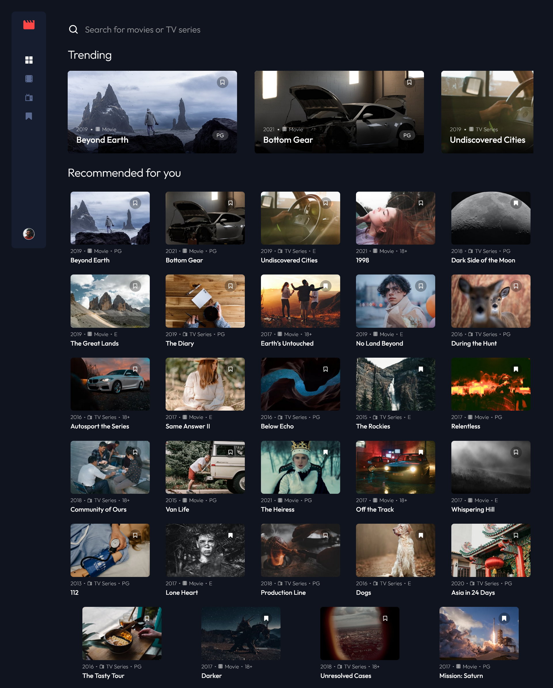

# Frontend Mentor - Entertainment web app solution

This is a solution to the [Entertainment web app challenge on Frontend Mentor](https://www.frontendmentor.io/challenges/entertainment-web-app-J-UhgAW1X). Frontend Mentor challenges help you improve your coding skills by building realistic project.

## Table of contents

- [Overview](#overview)
  - [The challenge](#the-challenge)
  - [Screenshot](#screenshot)
  - [Links](#links)
- [My process](#my-process)
  - [Built with](#built-with)
- [Author](#author)

## Overview

### The challenge

Users should be able to:

- View the optimal layout for the app depending on their device's screen size
- See hover states for all interactive elements on the page
- Navigate between Home, Movies, TV Series, and Bookmarked Shows pages
- Add/Remove bookmarks from all movies and TV series
- Search for relevant shows on all pages
- **Bonus**: Build this project as a full-stack application
- **Bonus**: If you're building a full-stack app, we provide authentication screen (sign-up/login) designs if you'd like to create an auth flow

### Screenshot

### Links

- Solution URL: [Link](https://your-solution-url.com)
- Live Site URL: [Link](https://your-live-site-url.com)

## My process

### Built with

*Frontend*:

- Angular
- TypeScript
- SASS
- SwiperJS
- Ngx Spinner
- Mobile-first workflow

*Backend*:

Available at this [link](https://gitlab.com/danielmrz.dev/entertainment-web-app-backend).

- NodeJS 
- TypeScript
- Express
- JWT (Json Web Token)

## Author

- LinkedIn - [@danielmrz-dev](https://www.linkedin.com/in/danielmrz-dev/)
- Frontend Mentor - [@danielmrz-dev](https://www.frontendmentor.io/profile/danielmrz-dev)
- Twitter - [@danielmrz_dev](https://www.twitter.com/danielmrz_dev)
- My portfolio - [Link](https://danielmrz-portfolio.vercel.app/)